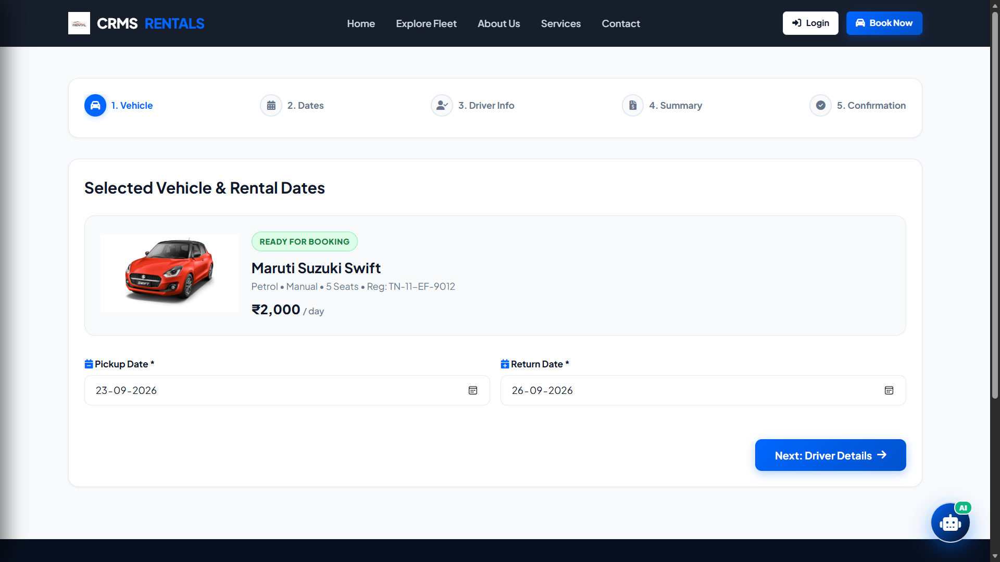

# 🚗 Car Rental Management System

A full-featured **web-based Car Rental Management System** developed to streamline and manage vehicle rentals, customers, bookings, billing, employees, attendance, and reporting through a centralized platform.

## 🌐 Live Demo

🔗 **[Visit the Live Car Rental Management System](https://carrentalmanagementwebpage.onrender.com/)**

> The live application is deployed using Render.

---

## ✨ Key Features

### 👤 Customer Portal

- Browse available vehicles
- View detailed vehicle information
- Book rental vehicles
- Submit rental information
- Request vehicle returns
- Access customer-related services

### 🛠️ Admin Panel

- Dashboard with real-time statistics
- Vehicle management
- Customer management
- Rental management
- Billing management
- Employee management
- Attendance management
- Reports and analytics
- Rental statistics and insights

---

## 🧰 Technology Stack

| Technology | Purpose |
|------------|---------|
| 🐍 Python | Backend development |
| 🌐 Flask | Web application framework |
| 🗄️ MySQL | Relational database |
| 🎨 HTML5 | Web structure |
| 🎨 CSS3 | Styling and responsive UI |
| ⚡ JavaScript | Client-side functionality |
| 🚀 Gunicorn | Production WSGI server |
| ☁️ Render | Application deployment |
| 🐙 GitHub | Source control and project management |

---

## 🗄️ Database

The system uses a **MySQL relational database** to manage application data, including:

- Vehicles
- Customers
- Rentals
- Billing
- Employees
- Attendance
- Reports
- Return requests
- Other system operations

The database is integrated with the Flask backend to provide centralized data management across the application.

---

## 🔐 Security

- Sensitive credentials are stored using environment variables.
- Database credentials are not included in the public repository.
- Application secrets are kept outside the source code.
- Production configuration is separated from publicly accessible project files.

---

## 📸 Application Screenshots

### 🏠 Home Page

### 🚘 Car Listing

### 🚗 Car Details

### 📅 Booking

### 🧾 Booking Summary

### 👤 Customer Dashboard

### 🚘 Driver Details

### 🔐 Login Page

### 📊 Admin Dashboard

---

## 👨‍💻 Developer

### **Amrit Roushan**

**Car Rental Management System — 2026**

---

## 📌 Project Overview

The **Car Rental Management System** provides a centralized platform for managing the complete vehicle rental workflow, from vehicle availability and customer bookings to rentals, billing, employee management, attendance, and reporting.

The project demonstrates the integration of a **Python Flask web application with a MySQL relational database**, along with production deployment using **Gunicorn and Render**.

---

⭐ **If you find this project interesting, feel free to explore the live application.**
